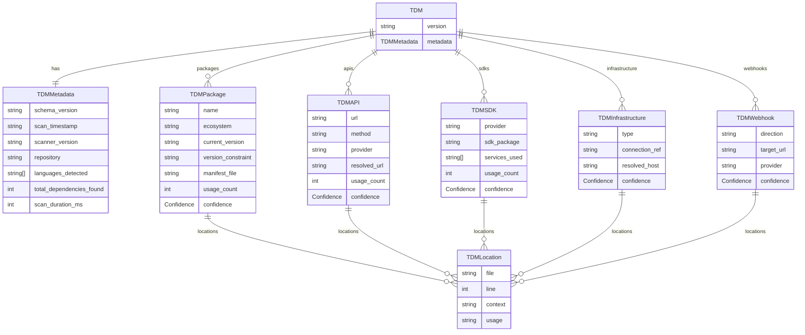

# feat: TDM Schema Specification & Validation Package

## Overview

Define the Thirdwatch Dependency Manifest (TDM) as a versioned, formally specified artifact. This is the core data contract the entire system is built around — the scanner produces TDMs, the watcher consumes them, the analyzer enriches them, and the notifier reads from them. The TDM is also the "plant the flag" OSS contribution: a standard format for expressing external dependency surfaces, analogous to SPDX or CycloneDX for licenses/vulnerabilities.

## Problem Statement

Without a formally specified, versioned schema with strict TypeScript types and JSON Schema validation, every layer of the system will have different assumptions about the manifest structure. Contractors building the scanner will produce data that the watcher doesn't expect. Community contributors will add fields that break existing parsers. Getting the schema right before any feature code is written prevents a class of coordination bugs.

## Proposed Solution

Publish `@thirdwatch/tdm` as a standalone npm package containing:
1. TypeScript type definitions for all TDM entities
2. A JSON Schema (`schema/v1/tdm.schema.json`) as the canonical specification
3. Validation utilities (parse + validate a TDM file, throw typed errors)
4. A schema changelog documenting breaking vs non-breaking changes
5. Example TDM files for reference and testing

## Technical Approach

### TDM Schema Design

The schema follows these design principles:
- **Append-only additions** are non-breaking (new optional fields)
- **Removals and type changes** are breaking (require a major version bump)
- **Required fields are minimal** — every field that's optional stays optional
- **`locations` are always arrays** — a dependency can appear in many files
- **`confidence` is always present** — consumers must handle uncertainty

### TypeScript Type Definitions (`packages/tdm/src/types.ts`)

```typescript
// packages/tdm/src/types.ts

export const TDM_SCHEMA_VERSION = "1.0" as const;

export type Confidence = "high" | "medium" | "low";
export type ChangeCategory =
  | "breaking"
  | "deprecation"
  | "major-update"
  | "minor-update"
  | "patch"
  | "security"
  | "informational";
export type Priority = "P0" | "P1" | "P2" | "P3" | "P4";

export interface TDMLocation {
  file: string;        // Relative path from scan root
  line: number;        // 1-indexed line number
  context?: string;    // Short code snippet for human readability
  usage?: string;      // e.g., "import", "method_call:stripe.Charge.create"
}

export interface TDMMetadata {
  schema_version: string;       // TDM schema semver, e.g., "1.0"
  scan_timestamp: string;       // ISO 8601
  scanner_version: string;      // thirdwatch scanner semver
  repository?: string;          // e.g., "github.com/acme/payments-service"
  languages_detected: string[]; // e.g., ["python", "javascript"]
  total_dependencies_found: number;
  scan_duration_ms: number;
}

export interface TDMPackage {
  name: string;
  ecosystem: "npm" | "pypi" | "go" | "maven" | "rubygems" | string;
  current_version: string;
  version_constraint?: string;   // e.g., "^7.0.0" or ">=3.0,<4.0"
  manifest_file: string;         // e.g., "requirements.txt"
  locations: TDMLocation[];
  usage_count: number;
  confidence: Confidence;
}

export interface TDMAPI {
  url: string;                  // Literal or template, e.g., "${BASE_URL}/v2/users"
  method?: string;              // HTTP verb
  provider?: string | null;     // Auto-detected provider slug, e.g., "stripe"
  resolved_url?: string;        // URL after env var resolution attempt
  headers?: string[];           // Header patterns found at call site
  locations: TDMLocation[];
  usage_count: number;
  confidence: Confidence;
}

export interface TDMSDK {
  provider: string;             // e.g., "aws", "stripe", "openai"
  sdk_package: string;          // e.g., "boto3", "@aws-sdk/client-s3"
  services_used?: string[];     // e.g., ["s3", "sqs"] for AWS
  api_methods?: string[];       // Specific methods called
  locations: TDMLocation[];
  usage_count: number;
  confidence: Confidence;
}

export interface TDMInfrastructure {
  type: "postgresql" | "mysql" | "mongodb" | "redis" | "elasticsearch"
      | "rabbitmq" | "kafka" | "sqs" | "s3" | "gcs" | "azure-blob" | string;
  connection_ref: string;       // The raw value (may be env var reference)
  resolved_host?: string | null;
  locations: TDMLocation[];
  confidence: Confidence;
}

export interface TDMWebhook {
  direction: "outbound_registration" | "inbound_callback";
  target_url: string;
  provider?: string;
  locations: TDMLocation[];
  confidence: Confidence;
}

export interface TDM {
  version: string;              // TDM schema version, e.g., "1.0"
  metadata: TDMMetadata;
  packages: TDMPackage[];
  apis: TDMAPI[];
  sdks: TDMSDK[];
  infrastructure: TDMInfrastructure[];
  webhooks: TDMWebhook[];
}
```

### JSON Schema (`schema/v1/tdm.schema.json`)

```json
// schema/v1/tdm.schema.json (abbreviated — full schema is ~200 lines)
{
  "$schema": "https://json-schema.org/draft/2020-12/schema",
  "$id": "https://thirdwatch.dev/schema/v1/tdm.schema.json",
  "title": "Thirdwatch Dependency Manifest",
  "description": "A structured manifest of all external dependencies discovered in a codebase.",
  "type": "object",
  "required": ["version", "metadata", "packages", "apis", "sdks", "infrastructure", "webhooks"],
  "properties": {
    "version": {
      "type": "string",
      "pattern": "^\\d+\\.\\d+$",
      "description": "TDM schema version in MAJOR.MINOR format."
    },
    "metadata": { "$ref": "#/$defs/TDMMetadata" },
    "packages": { "type": "array", "items": { "$ref": "#/$defs/TDMPackage" } },
    "apis": { "type": "array", "items": { "$ref": "#/$defs/TDMAPI" } },
    "sdks": { "type": "array", "items": { "$ref": "#/$defs/TDMSDK" } },
    "infrastructure": { "type": "array", "items": { "$ref": "#/$defs/TDMInfrastructure" } },
    "webhooks": { "type": "array", "items": { "$ref": "#/$defs/TDMWebhook" } }
  },
  "$defs": {
    "Confidence": {
      "type": "string",
      "enum": ["high", "medium", "low"]
    },
    "TDMLocation": {
      "type": "object",
      "required": ["file", "line"],
      "properties": {
        "file": { "type": "string" },
        "line": { "type": "integer", "minimum": 1 },
        "context": { "type": "string" },
        "usage": { "type": "string" }
      }
    }
  }
}
```

### Validation Utilities (`packages/tdm/src/validate.ts`)

```typescript
// packages/tdm/src/validate.ts
import Ajv from "ajv/dist/2020.js";
import addFormats from "ajv-formats";
import schema from "../../schema/v1/tdm.schema.json" with { type: "json" };
import type { TDM } from "./types.js";

const ajv = new Ajv({ allErrors: true });
addFormats(ajv);
const validate = ajv.compile(schema);

export class TDMValidationError extends Error {
  constructor(public readonly errors: typeof validate.errors) {
    super(`TDM validation failed: ${JSON.stringify(errors, null, 2)}`);
    this.name = "TDMValidationError";
  }
}

export function parseTDM(input: unknown): TDM {
  if (!validate(input)) {
    throw new TDMValidationError(validate.errors);
  }
  return input as TDM;
}

export function parseTDMFromString(json: string): TDM {
  return parseTDM(JSON.parse(json));
}
```

### Package `package.json`

```json
// packages/tdm/package.json
{
  "name": "@thirdwatch/tdm",
  "version": "0.1.0",
  "description": "Thirdwatch Dependency Manifest types, schema, and validation",
  "license": "Apache-2.0",
  "main": "./dist/index.js",
  "types": "./dist/index.d.ts",
  "exports": {
    ".": {
      "import": "./dist/index.js",
      "types": "./dist/index.d.ts"
    },
    "./schema": "./schema/v1/tdm.schema.json"
  },
  "files": ["dist", "schema"],
  "scripts": {
    "build": "tsc",
    "test": "vitest run",
    "typecheck": "tsc --noEmit"
  },
  "dependencies": {
    "ajv": "^8.17.0",
    "ajv-formats": "^3.0.1"
  }
}
```

### ERD — TDM Entity Relationships



## Implementation Phases

### Phase 2.1: Types & Schema
- Write all TypeScript types in `packages/tdm/src/types.ts`
- Write the full JSON Schema in `schema/v1/tdm.schema.json`
- Ensure types and schema are in sync (they describe the same data model)

### Phase 2.2: Validation Utilities
- Implement `parseTDM` and `parseTDMFromString` using Ajv
- Write typed error class `TDMValidationError`

### Phase 2.3: Examples
- Create `schema/v1/examples/payment-service.tdm.json` (the sample from the PRD)
- Create `schema/v1/examples/node-api.tdm.json` (Node.js specific)
- Both examples must validate against the JSON Schema (tested in CI)

### Phase 2.4: Documentation
- Write `docs/architecture/tdm-spec.md` — the human-readable TDM specification
- Document the versioning policy (what constitutes a breaking change)
- Document how to extend the schema for future field additions

## Acceptance Criteria

- [ ] `packages/tdm` builds and exports clean TypeScript types with zero errors
- [ ] JSON Schema at `schema/v1/tdm.schema.json` validates both example files without errors
- [ ] `parseTDM(validInput)` returns a typed `TDM` object
- [ ] `parseTDM(invalidInput)` throws `TDMValidationError` with readable error messages
- [ ] Schema and TypeScript types are in sync (no field in one that's missing from the other)
- [ ] `@thirdwatch/tdm` is published to npm (even as `0.1.0`)
- [ ] `docs/architecture/tdm-spec.md` exists and matches the implemented schema
- [ ] All example TDM files pass schema validation in CI

## File Inventory

| File | Description |
|---|---|
| `packages/tdm/src/types.ts` | All TypeScript types |
| `packages/tdm/src/validate.ts` | Validation utilities |
| `packages/tdm/src/index.ts` | Public API re-exports |
| `packages/tdm/package.json` | Package manifest |
| `packages/tdm/tsconfig.json` | TypeScript config |
| `packages/tdm/vitest.config.ts` | Test config |
| `packages/tdm/src/validate.test.ts` | Validation unit tests |
| `schema/v1/tdm.schema.json` | JSON Schema (canonical spec) |
| `schema/v1/examples/payment-service.tdm.json` | Example TDM |
| `schema/v1/examples/node-api.tdm.json` | Example TDM |
| `docs/architecture/tdm-spec.md` | Human-readable spec |

## References

- [SPDX Specification](https://spdx.github.io/spdx-spec/) — SBOM standard for reference
- [CycloneDX Schema](https://github.com/CycloneDX/specification) — Another SBOM standard
- [JSON Schema 2020-12](https://json-schema.org/draft/2020-12/json-schema-core)
- [Ajv](https://ajv.js.org/) — JSON Schema validator for Node.js
- PRD Section 7 — TDM Schema Specification
