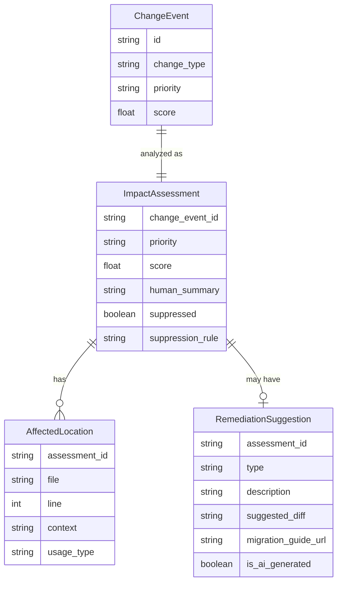

# feat: Analyzer — Impact Scoring, Code Mapping & Remediation

## Overview

Build `@thirdwatch/analyzer` — Layer 3 of the system. Where the Watcher detects *what* changed and the Classifier determines *how serious* the change type is, the Analyzer determines *how much this affects your specific codebase*. It cross-references classified change events against the TDM's actual usage patterns to produce a P0–P4 priority score, a precise list of affected files and line numbers, and (for common breaking changes) a draft code change suggestion.

## Problem Statement

A "breaking" change on an endpoint you call 200 times in 12 critical files is a P0 incident. A "breaking" change on an endpoint you call once in a test file is P3. Without the Analyzer, every breaking change looks identical — the Watcher has no codebase context. The Analyzer is what makes Thirdwatch's alerts actionable rather than just accurate.

## Proposed Solution

A TypeScript package (`packages/analyzer`) that:
1. **Impact Scoring** — assigns P0–P4 based on usage frequency, code spread, criticality path, and change severity
2. **Affected Code Mapping** — produces exact file:line pairs affected by each change
3. **Remediation Suggestions** — generates structured migration guidance for common breaking patterns
4. **Noise Suppression** — respects user-configured suppression rules to filter irrelevant alerts

## Technical Approach

### Impact Scoring Algorithm

```
                    ┌─────────────────────────────────────────┐
                    │           Impact Score (P0–P4)          │
                    │                                         │
                    │  = Severity × (Usage × Spread × Path)  │
                    └─────────────────────────────────────────┘

Severity (from change category):
  breaking    = 5
  security    = 5
  deprecation = 3
  major-update = 2
  minor-update = 1
  patch        = 0.5
  informational = 0

Usage (from TDM usage_count):
  > 100   = 3
  > 20    = 2
  > 5     = 1.5
  > 0     = 1

Spread (unique files in TDM locations):
  > 10 files = 3
  > 3 files  = 2
  > 1 file   = 1

Criticality Path (directory heuristics):
  matches auth/, payments/, checkout/, billing/, security/ = 3
  matches api/, services/, core/ = 2
  matches tests/, spec/, __tests__/ = 0.3

Final Score → Priority:
  ≥ 30  → P0
  ≥ 15  → P1
  ≥ 7   → P2
  ≥ 3   → P3
  < 3   → P4
```

### Types (`packages/analyzer/src/types.ts`)

```typescript
// packages/analyzer/src/types.ts

export interface ImpactAssessment {
  changeEventId: string;
  priority: Priority;
  score: number;                    // Raw computed score (for debugging)
  affectedLocations: AffectedLocation[];
  humanSummary: string;             // One-sentence human-readable summary
  remediationSuggestion?: RemediationSuggestion;
  suppressionRule?: string;         // If suppressed, which rule matched
}

export interface AffectedLocation {
  file: string;           // Relative path
  line: number;
  context: string;        // Code snippet
  usageType: string;      // "method_call", "import", "instantiation"
}

export interface RemediationSuggestion {
  type: "rename-parameter" | "update-endpoint" | "update-auth" | "update-import" | "manual";
  description: string;
  suggestedDiff?: string;  // Unified diff format, flagged as AI-generated
  migrationGuideUrl?: string;
  isAIGenerated: boolean;
}
```

### Impact Scorer (`packages/analyzer/src/impact-scorer.ts`)

```typescript
// packages/analyzer/src/impact-scorer.ts

export function computeImpactScore(
  change: ChangeEvent,
  dependency: WatchedDependency,
  tdm: TDM
): { score: number; priority: Priority; components: ScoreComponents } {
  const severity = SEVERITY_WEIGHTS[change.changeType];

  // Find all TDM entries for this dependency
  const tdmEntries = findTDMEntries(dependency, tdm);
  const totalUsage = tdmEntries.reduce((sum, e) => sum + e.usage_count, 0);
  const uniqueFiles = new Set(tdmEntries.flatMap(e => e.locations.map(l => l.file)));

  const usage = usageWeight(totalUsage);
  const spread = spreadWeight(uniqueFiles.size);
  const path = criticalityPathWeight([...uniqueFiles], dependency.criticalityPaths);

  const score = severity * usage * spread * path;
  const priority = scoreToPriority(score);

  return { score, priority, components: { severity, usage, spread, path } };
}

function criticalityPathWeight(files: string[], overrides: string[]): number {
  const DEFAULT_CRITICAL = ["auth", "payment", "checkout", "billing", "security", "login"];
  const DEFAULT_IMPORTANT = ["api", "service", "core", "handler", "middleware"];
  const DEFAULT_LOW = ["test", "spec", "__test__", "fixture", "mock"];

  const patterns = [...DEFAULT_CRITICAL, ...overrides];

  if (files.some(f => DEFAULT_LOW.some(p => f.includes(p)))) return 0.3;
  if (files.some(f => patterns.some(p => f.toLowerCase().includes(p)))) return 3;
  if (files.some(f => DEFAULT_IMPORTANT.some(p => f.includes(p)))) return 2;
  return 1;
}
```

### Affected Code Mapper (`packages/analyzer/src/code-mapper.ts`)

```typescript
// packages/analyzer/src/code-mapper.ts

/**
 * Given a change event and TDM, returns precise file:line locations
 * with human-readable context.
 *
 * Example output:
 * "You call POST /v1/charges with parameter `source` which was removed in
 * Stripe API version 2025-12-01. Found in:
 *   payments/stripe_client.py:47 (method_call: stripe.Charge.create)
 *   checkout/handler.py:112 (method_call: stripe.PaymentIntent.create)"
 */
export function mapAffectedCode(
  change: ChangeEvent,
  tdm: TDM
): AffectedLocation[] {
  const entries = findTDMEntries(change.dependency, tdm);
  return entries.flatMap(entry =>
    entry.locations.map(loc => ({
      file: loc.file,
      line: loc.line,
      context: loc.context ?? "",
      usageType: loc.usage ?? "unknown",
    }))
  );
}

export function buildHumanSummary(
  change: ChangeEvent,
  locations: AffectedLocation[]
): string {
  const fileCount = new Set(locations.map(l => l.file)).size;
  const callCount = locations.length;
  const dep = change.dependency.identifier;

  return `${dep} has a ${change.changeType} change (${change.newVersion}). ` +
    `Found ${callCount} usages across ${fileCount} file${fileCount > 1 ? "s" : ""}.`;
}
```

### Remediation Engine (`packages/analyzer/src/remediation.ts`)

```typescript
// packages/analyzer/src/remediation.ts

/**
 * For known breaking change patterns, generate structured remediation guidance.
 * All AI-generated code suggestions are flagged isAIGenerated: true.
 */
export async function generateRemediation(
  change: ChangeEvent,
  locations: AffectedLocation[],
  config: AnalyzerConfig
): Promise<RemediationSuggestion | undefined> {
  // First try: registry-based remediation (deterministic, from changelog registry)
  const registryRemediation = lookupRegistryRemediation(change);
  if (registryRemediation) return { ...registryRemediation, isAIGenerated: false };

  // Second try: LLM-generated suggestion (opt-in)
  if (config.llm?.enableCodeSuggestions && change.changeType === "breaking") {
    return generateLLMRemediation(change, locations, config.llm);
  }

  // Fallback: link to migration guide if available
  if (change.url) {
    return {
      type: "manual",
      description: `Review the ${change.dependency.identifier} migration guide.`,
      migrationGuideUrl: change.url,
      isAIGenerated: false,
    };
  }
}
```

### Remediation Registry (`registries/remediations/stripe.yml`)

```yaml
# registries/remediations/stripe.yml
provider: stripe
remediations:
  - match:
      change_type: breaking
      version_range: ">=2023-10-16"
      affected_parameter: "source"
      affected_endpoint: "/v1/charges"
    suggestion:
      type: rename-parameter
      description: "The `source` parameter was removed. Use `payment_method` instead."
      suggested_diff: |
        - stripe.Charge.create(amount=amount, currency="usd", source=token)
        + stripe.PaymentIntent.create(amount=amount, currency="usd", payment_method=token)
      migration_guide_url: "https://stripe.com/docs/upgrades#2023-10-16"
```

### Noise Suppression (`packages/analyzer/src/suppression.ts`)

```typescript
// packages/analyzer/src/suppression.ts

// .thirdwatch.yml suppression rules
export interface SuppressionRule {
  reason?: string;
  dependency?: string;     // Glob pattern, e.g., "stripe*"
  change_category?: ChangeCategory;
  min_priority?: Priority; // Suppress if priority is lower than this
  file_path?: string;      // Glob — suppress if ALL affected files match
}

export function shouldSuppress(
  assessment: ImpactAssessment,
  rules: SuppressionRule[]
): { suppressed: boolean; rule?: SuppressionRule } {
  for (const rule of rules) {
    if (matchesRule(assessment, rule)) {
      return { suppressed: true, rule };
    }
  }
  return { suppressed: false };
}
```

### Analyzer Configuration (`.thirdwatch.yml`)

```yaml
# .thirdwatch.yml — Analyzer config
analyzer:
  # Paths to treat as high criticality (multiplies impact score)
  critical_paths:
    - "src/payments/**"
    - "src/auth/**"

  # Suppression rules
  suppress:
    - dependency: "eslint"          # Never alert on eslint updates
      reason: "Dev tooling only"
    - change_category: patch        # Never alert on patch updates
    - min_priority: P3              # Only P0/P1/P2 generate notifications
      change_category: minor-update

  # LLM code suggestions (Phase 3 feature)
  llm:
    enable_code_suggestions: false  # Opt-in
```

### ERD — Analyzer Extension



### Database Extensions

```sql
-- migrations/003_impact_assessments.sql

ALTER TABLE change_events
  ADD COLUMN priority TEXT,
  ADD COLUMN impact_score FLOAT,
  ADD COLUMN human_summary TEXT,
  ADD COLUMN suppressed BOOLEAN DEFAULT false,
  ADD COLUMN suppression_rule TEXT;

CREATE TABLE affected_locations (
  id UUID PRIMARY KEY DEFAULT gen_random_uuid(),
  change_event_id UUID REFERENCES change_events(id),
  file TEXT NOT NULL,
  line INTEGER NOT NULL,
  context TEXT,
  usage_type TEXT
);

CREATE TABLE remediation_suggestions (
  id UUID PRIMARY KEY DEFAULT gen_random_uuid(),
  change_event_id UUID REFERENCES change_events(id),
  suggestion_type TEXT NOT NULL,
  description TEXT NOT NULL,
  suggested_diff TEXT,
  migration_guide_url TEXT,
  is_ai_generated BOOLEAN DEFAULT false
);
```

## Implementation Phases

### Phase 9.1: Impact Scorer
- Implement `computeImpactScore` with all four components
- Unit tests: verify P0 for breaking + 100 usages in `payments/`, P4 for patch in tests/
- Integration test: analyze a fixture change event against a fixture TDM

### Phase 9.2: Code Mapper
- Implement `mapAffectedCode` to extract precise file:line from TDM
- Implement `buildHumanSummary` for the one-sentence description
- Test: verify output matches PRD example format (file:line with usage type)

### Phase 9.3: Remediation Registry
- Create `registries/remediations/stripe.yml` with known breaking changes
- Implement `lookupRegistryRemediation` with pattern matching
- Test: Stripe `source` → `payment_method` migration suggestion triggers correctly

### Phase 9.4: LLM Remediation (opt-in)
- Implement `generateLLMRemediation` with code suggestion prompt
- Flagging: all LLM-generated diffs are clearly marked `isAIGenerated: true`
- Cost guard: only trigger when `enable_code_suggestions: true` AND `breaking`

### Phase 9.5: Suppression
- Implement suppression rule engine
- Wire into pipeline: suppressed events are stored but don't trigger notifications
- Test: verify suppressed events appear in `GET /api/v1/changes` with `suppressed: true`

### Phase 9.6: Wire into Worker
- Run Analyzer after Classifier in the worker job pipeline
- Store `ImpactAssessment` fields on `change_events` table
- Insert `affected_locations` and `remediation_suggestions` rows

## Acceptance Criteria

- [ ] A breaking change on `stripe` with 100 usages in `payments/` produces P0
- [ ] A breaking change on `stripe` with 1 usage in `tests/` produces P3
- [ ] A patch change on any dependency produces P4
- [ ] `mapAffectedCode` returns correct file + line numbers from the TDM
- [ ] Human summary matches format: "[dep] has a [type] change. Found N usages across M files."
- [ ] Stripe `source` → `payment_method` remediation triggers from the registry YAML
- [ ] LLM remediation is NOT called when `enable_code_suggestions: false`
- [ ] Suppressed events have `suppressed: true` and `suppression_rule` in the database
- [ ] Impact score components are logged for debugging

## File Inventory

| File | Description |
|---|---|
| `packages/analyzer/src/types.ts` | ImpactAssessment, AffectedLocation, RemediationSuggestion |
| `packages/analyzer/src/impact-scorer.ts` | Impact scoring algorithm |
| `packages/analyzer/src/code-mapper.ts` | Affected code mapping |
| `packages/analyzer/src/remediation.ts` | Remediation suggestions |
| `packages/analyzer/src/suppression.ts` | Noise suppression |
| `packages/analyzer/src/index.ts` | Public API |
| `packages/analyzer/src/__tests__/impact-scorer.test.ts` | Scoring unit tests |
| `packages/analyzer/src/__tests__/code-mapper.test.ts` | Mapping unit tests |
| `registries/remediations/stripe.yml` | Stripe remediation registry |
| `registries/remediations/openai.yml` | OpenAI remediation registry |
| `migrations/003_impact_assessments.sql` | DB migration |

## References

- PRD FR-3.1 through FR-3.4
- [unified diff format](https://www.gnu.org/software/diffutils/manual/diffutils.html#Unified-Format)
